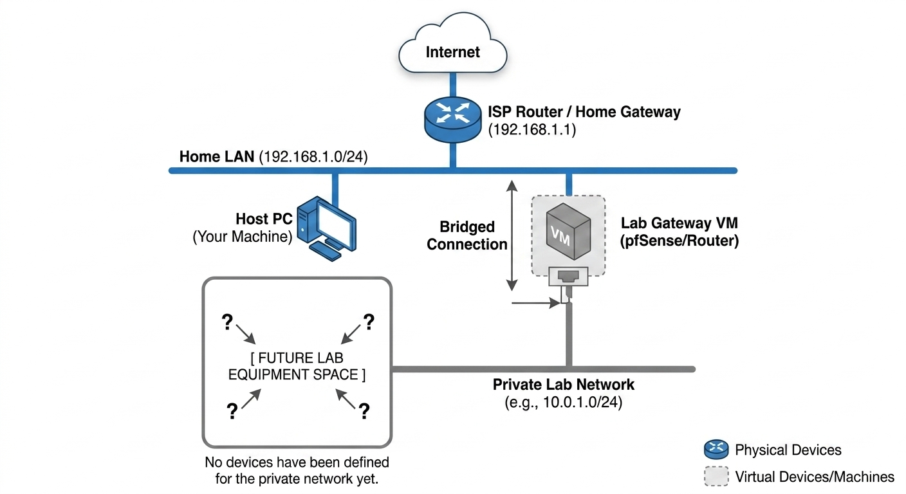

# 🌐 virtual-homelab

### Infraestructura de red y seguridad virtualizada.
***
Este proyecto es un entorno evolutivo diseñado para simular redes corporativas, probar configuraciones de sistemas, redes y nuevas tecnologias, e incluso crear futuros laboratorios de prueba para pentesting/auditorias de seguridad.

---

## 📍 Estado del Proyecto

El proyecto se divide en varias fases previamente definidas, donde se distribuyen las tareas de forma estructurada para facilitar su desarrollo, seguimiento y mantenimiento. De esta manera se evita el dispersamiento, puediendo centrarnos en completar cada fase sin abordar múltiples tareas a la vez y sin dejar procesos a medias.

Actualmente trabajando en la **Fase 2**. 

| Fase | Hito | Estado |
| :--- | :--- | :--- |
| **Fase 0** | Core Infra (pfSense + Virtual Networking) | 🟢 **Completado** |
| **Fase 1** | Directorio Activo y Gestión de Identidad | 🟢 **Completado** |
| **Fase 2** | Hardening y Monitorización (SIEM) | ⏳ Pendiente |

> [!INFO]
> A medida que el proyecto se vaya desarrollando, se irán definiendo nuevas fases, en base a los requerimientos u objetivos en ese momento.

---

## 🏗️ Arquitectura de Red Actual

> Puedes encontrar los diagramas detallados en la carpeta `/diagrams`.

---

## 📂 Estructura del Repositorio

- `docs/`: Documentación técnica detallada de cada servicio.
- `diagrams/`: Esquemas lógicos y físicos de la red.
- `configs/`: Archivos de configuración de sistemas y servicios (Router, Switch, pfSense, .conf, .ini...)
- `scripts/`: Automatizaciones en PowerShell, Bash o Python.

---

## 🛠️ Stack Tecnológico

- **Hipervisor:** VMware Workstation
- **Networking:** pfSense
- **Sistemas:** Windows Server 2022, FreeBSD, Linux
- **Seguridad:** 🔜Coming soon...

---