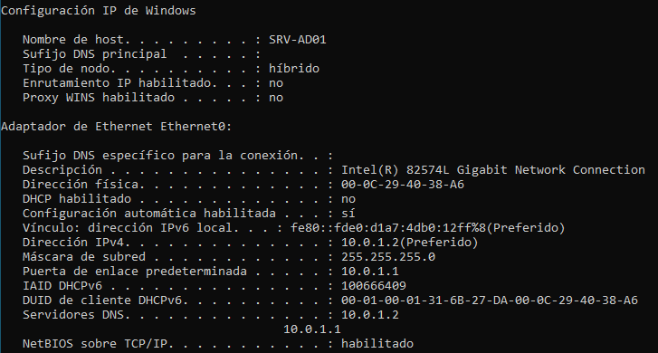
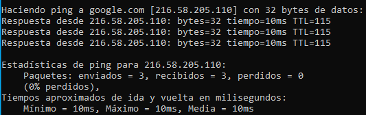

# Administración de Windows Server 2025

## Índice
1. [Fase 0: Infraestructura Core (Servidor Base)](#1-fase-0-infraestructura-core-servidor-base)
    * [Introducción](#introducción)
    * [Especificaciones de Hardware](#especificaciones-de-hardware)
    * [Configuración de Red y Conectividad](#configuración-de-red-y-conectividad)
    * [Configuración del Sistema (OS)](#configuración-del-sistema-os)
    * [Verificación y Evidencias](#verificación-y-evidencias)

---

## 1. Fase 0: Infraestructura Core (Servidor Base)

### Introducción

En esta fase se ha desplegado un servidor **Windows Server 2022 Standard (Desktop Experience)** que actuará como el controlador de dominio principal del HomeLab. Se ha priorizado una configuración de red estática y un esquema de nombrado estandarizado para facilitar la gestión en fases posteriores.

### Especificaciones de Hardware
| Recurso           | Configuración       | Justificación Técnica                               |
|:------------------|:--------------------|:----------------------------------------------------|
| **CPU** | 2 vCPUs             | Mínimo recomendado para entorno gráfico fluido.     |
| **RAM** | 4 GB                | Optimización para servicios de AD DS y DNS.         |
| **Almacenamiento**| 60 GB NVMe          | Rendimiento superior en lectura/escritura de DB.    |

### Configuración de Red y Conectividad
Para integrar el servidor en el ecosistema del laboratorio, se han definido los siguientes parámetros a nivel de hipervisor y direccionamiento:

**A. Nivel de Virtualización (VMware):**
* **Adaptador de Red:** 1 (Único).
* **Tipo de Conexión:** LAN Segment.
* **Nombre del Segmento:** `homelab`.
* **Propósito:** Garantizar que el servidor solo sea visible para el pfSense y otros activos del laboratorio, quedando aislado de la red física.

**B. Direccionamiento IPv4:**
* **Dirección IP:** `10.0.1.2`
* **Máscara de Subred:** `255.255.255.0`
* **Puerta de Enlace:** `10.0.1.1` (pfSense)

---

### Configuración del Sistema (OS)
* **Nombre de Host (Hostname):** `SRV-AD01`
* **Sistema Operativo:** Windows Server 2022 Standard
* **Servidor DNS Primario:** `10.0.1.2`
    * Se establece el propio servidor como DNS principal, dejandolo preaparado para una futura configuración en próximas fases.
* **Servidor DNS Secundario:** `10.0.1.1` 
    * A modo de respaldo y durante la ausencia del servidor principal, se establece el DNS de pfSense.

---

### Verificaciones y Evidencias

#### A. Identidad del Sistema e IP
- [x] **Estado:** Hostname actualizado a `SRV-AD01` e IP estática asignada satisfactoriamente.
> **Evidencia:** 
> 

#### B. Conectividad 
- [x] **Estado:** El servidor tiene salida a internet a través del firewall y está correctamente ubicado en el segmento `homelab`.
> **Evidencia:** 
> 

***

## 2. Fase 1: Directorio Activo y Gestión de Identidad

### Introducción

En esta fase se ha realizado la implementación y configuración básica del **Directorio Activo (AD DS)**, así como su respectivo servidor DNS. De esta manera, convertimos el servidor en el punto donde se centraliza la gestión de usuarios, equipos, políticas/directivas y recursos de la red. 

***

### Configuración del Dominio

* **Nombre de Dominio (FQDN):** `homelab.local`
* **Roles Instalados:** 
    * **AD DS:** Permite la implantación del dominio, y, junto a ello, la gestión centralizada de objetos de la red.
    * **DNS Server:** Permite que las consultas DNS internas (`.homelab.local` en este caso) se realicen satisfactoriamente. 
* **Usuarios:** Para la configuración inicial del dominio, se ha creado un usuario genérico llamado `Lab Guest`. 

***
### Notas adicionales

Debido a que finalmente, al contrario de lo que se explicó en la fase anterior, se ha decidido que la gestión de las consultas DNS se realizarán por parte del router (pfSense) de manera centralizada, se ha tenido que añadir una configuración extra en este equipo, añadiendo un **Domain Override**, el cual al recibir una consulta con el dominio `.homelab.local`, delegara su resolución al servidor DNS de Windows Server. Para más información al respecto, mirar la documentación de pfSense en `/docs/01-pfSense.md` 

***

### Verificación y Evidencias
- [ ] **Estado:** Promoción a DC completada.
> Evidencia
>
>

- [ ] **Estado:** Resolución DNS correcta (nslookup).
> Evidencia
>
>

- [ ] **Estado:** Usuario de prueba creado y validado.
> Evidencia
>
>